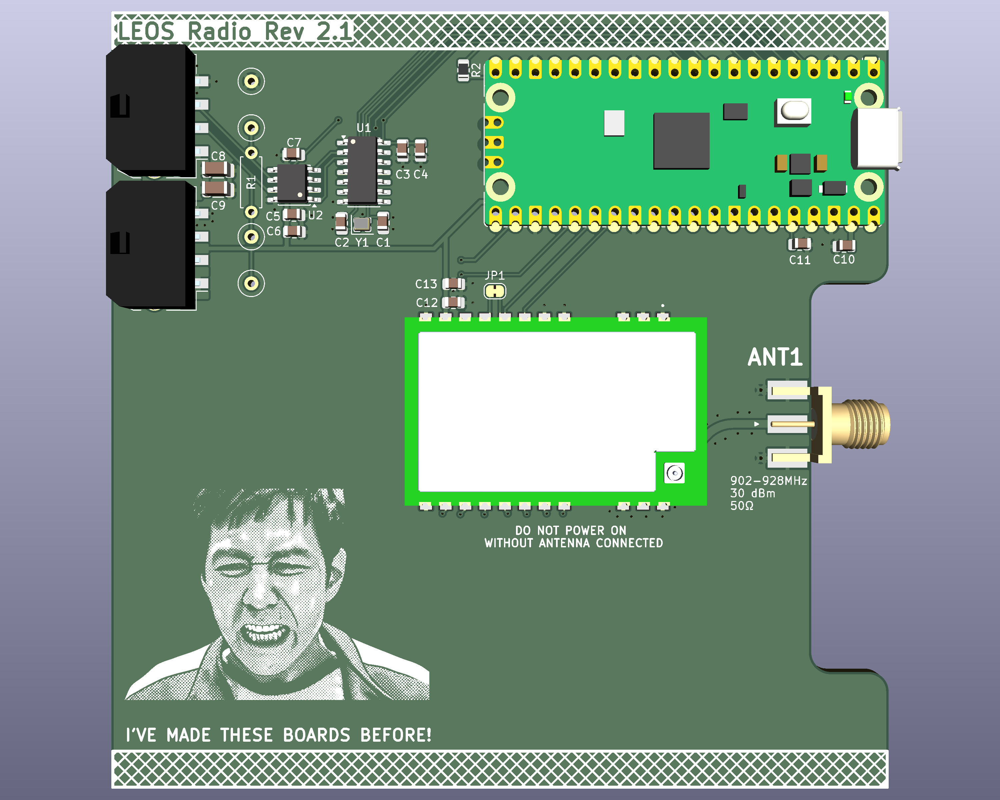

# LEOS Radio PCB

This repository contains the KiCad schematic and PCB layout for the LEOS Radio PCB made fall 2026. The board integrates a Raspberry Pi Pico, an E22-900M30S LoRa radio module, and a CAN-FD interface.

The Raspberry Pi Pico communicates with the radio module through SPI1 and the MCP2518FD CAN-FD controller through SPI0. An MCP2562FD transceiver connects the CAN controller to the LEOS CAN bus. An SMA connector provides the connection for an external antenna.

## Board Overview
Main hardware functions:
- Wireless communication: E22-900M30S LoRa radio module provides wireless transmission and reception through an external antenna connected to the SMA connector.
- CAN-FD communication: MCP2518FD controller and MCP2562FD transceiver provide the interface to the LEOS CAN bus.
- Microcontroller control: Pico interfaces with the radio module and CAN controller through separate SPI buses. Additional GPIO connections provide radio reset, busy monitoring, interrupt, and receive-enable signals.

## Electrical Design
- Board supply: 5 V
- Microcontroller: Raspberry Pi Pico, as labeled in the schematic
- Radio module: E22-900M30S
- CAN-FD controller: MCP2518FD
- CAN-FD transceiver: MCP2562FD
- Bus connectors: Two four-pin MicroFit connectors

